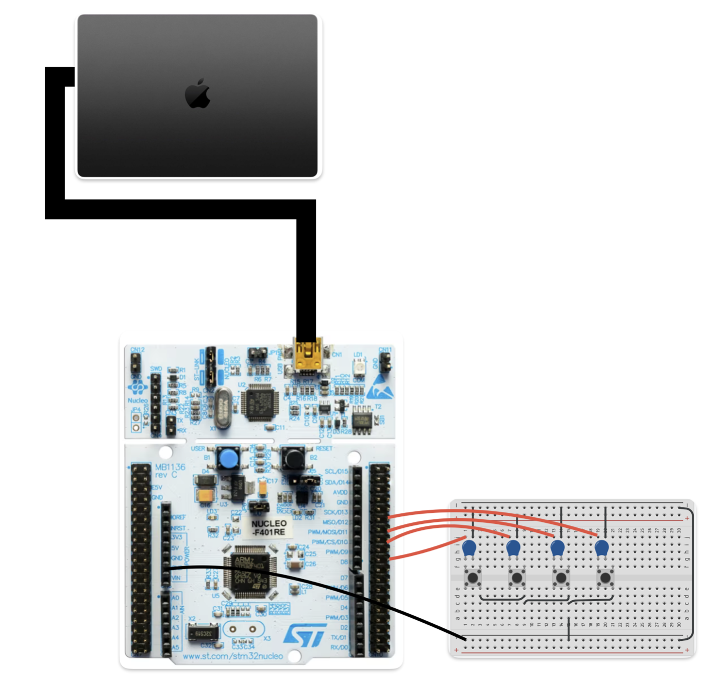

# Custom Video Game and Controller

## Overview
This project is a 2D video game developed in C++ with a custom game controller built using an STM32 microcontroller. The game is a remake of the 
classic arcade game known as Asteroids. 

The controller was prototyped on a breadboard and communicates with the game via USB, allowing for real-time interaction.

---

## Features
- **2D Gameplay Mechanics**: Implemented player movement, collision detection
- **Custom Game Controller**:
  - Built with STM32 microcontroller programmed in C.
  - Prototyped on a breadboard for rapid development.
  - USB communication for seamless integration with the game.

- **Cross-Platform Compatibility**: Game can run on Mac OS.

---

## Technologies Used
- **Programming Languages**: C++ (game development), C (controller firmware).
- **Hardware**: STM32 microcontroller.
- **Game Development Libraries**:  SFML.
- **Prototyping**: Breadboard for hardware testing.

---
## Controller configuration
- The game supports a custom controller built using an STM32 microcontroller. Follow the steps below to set up and configure the controller.

- **Hardware:
    -An STM32 microcontroller.
    -A USB cable for connecting the controller to your computer.
    -4 buttons
    -4 100nF capacitors

    
    note: the actual pins used are PB0-PB3 
---

1. Clone the repository:
   ```bash
   git clone https://github.com/Churro209/game.git

2. Plug the controller into your macOS computer using the USB cable.

3. upload firmware onto microcontroller:
    Easiest way is to move the "Controller software" folder into Stm32CubeIDE 
    and then build->debug


4. After uploading firmware onto microcontroller go back to terminal to identify the Serial Port name the 
microcontroller is connected to:
    ```bash
    ls /dev/tty.*

save this value. 

5. navigate to project directory->src-> main.cpp
    and change name from "/dev/tty.usbmodem2103" to 
    port found in step 4. See image for reference. 
    


6. Navigate to Project directory, and go to "game" directory 
    ```bash
    cd game

7. make and enter build directory
    ```bash 
    mkdir build
    cd build

8. run cmake to build game while in build directory:
    ```bash
    cmake ..

9. once build files are made compile project(still in build directory):
    ```bash
    make
    
10. cd into bin directory and run the game
    ```bash
    cd bin
    ./Asteroids_Run 


---

# CMake SFML Project Template

This repository template should allow for a fast and hassle-free kick start of your next SFML project using CMake.
Thanks to [GitHub's nature of templates](https://docs.github.com/en/repositories/creating-and-managing-repositories/creating-a-repository-from-a-template), you can fork this repository without inheriting its Git history.

The template starts out very basic, but might receive additional features over time:

- Basic CMake script to build your project and link SFML on any operating system
- Basic [GitHub Actions](https://github.com/features/actions) script for all major platforms

## How to Use

1. Follow the above instructions about how to use GitHub's project template feature to create your own project.
1. Open [CMakeLists.txt](CMakeLists.txt). Rename the project and the executable to whatever name you want. The project and executable names don't have to match.
1. If you want to add or remove any .cpp files, change the source files listed in the [`add_executable`](CMakeLists.txt#L10) call in CMakeLists.txt to match the source files your project requires. If you plan on keeping the default main.cpp file then no changes are required.
1. If you use Linux, install SFML's dependencies using your system package manager. On Ubuntu and other Debian-based distributions you can use the following commands:
    ```
    sudo apt update
    sudo apt install \
        libxrandr-dev \
        libxcursor-dev \
        libudev-dev \
        libfreetype-dev \
        libopenal-dev \
        libflac-dev \
        libvorbis-dev \
        libgl1-mesa-dev \
        libegl1-mesa-dev
    ```
1. Configure and build your project. Most popular IDEs support CMake projects with very little effort on your part.
    - [VS Code](https://code.visualstudio.com) via the [CMake extension](https://code.visualstudio.com/docs/cpp/cmake-linux)
    - [Visual Studio](https://docs.microsoft.com/en-us/cpp/build/cmake-projects-in-visual-studio?view=msvc-170)
    - [CLion](https://www.jetbrains.com/clion/features/cmake-support.html)
    - [Qt Creator](https://doc.qt.io/qtcreator/creator-project-cmake.html)

    Using CMake from the command line is straightforward as well.

    For a single-configuration generator (typically the case on Linux and macOS):
    ```
    cmake -S . -B build -DCMAKE_BUILD_TYPE=Release
    cmake --build build
    ```

    For a multi-configuration generator (typically the case on Windows):
    ```
    cmake -S . -B build
    cmake --build build --config Release
    ```
1. Enjoy!

## Upgrading SFML

SFML is found via CMake's [FetchContent](https://cmake.org/cmake/help/latest/module/FetchContent.html) module.
FetchContent automatically downloads SFML from GitHub and builds it alongside your own code.
Beyond the convenience of not having to install SFML yourself, this ensures ABI compatability and simplifies things like specifying static versus shared libraries.

Modifying what version of SFML you want is as easy as changing the [`GIT_TAG`](CMakeLists.txt#L7) argument.
Currently it uses the latest in-development version of SFML 2 via the `2.6.x` tag.
If you're feeling adventurous and want to give SFML 3 a try, use the `master` tag.
Beware, this requires changing your code to suit the modified API!
The nice folks in the [SFML community](https://github.com/SFML/SFML#community) can help you with that transition and the bugs you may encounter along the way.

## But I want to...

Modify CMake options by adding them as configuration parameters (with a `-D` flag) or by modifying the contents of CMakeCache.txt and rebuilding.

### Use Static Libraries

By default SFML builds shared libraries and this default is inherited by your project.
CMake's [`BUILD_SHARED_LIBS`](https://cmake.org/cmake/help/latest/variable/BUILD_SHARED_LIBS.html) option lets you pick static or shared libraries for the entire project.

### Change Compilers

See the variety of [`CMAKE_<LANG>_COMPILER`](https://cmake.org/cmake/help/latest/variable/CMAKE_LANG_COMPILER.html) options.
In particular you'll want to modify `CMAKE_CXX_COMPILER` to point to the C++ compiler you wish to use.

### Change Compiler Optimizations

CMake abstracts away specific optimizer flags through the [`CMAKE_BUILD_TYPE`](https://cmake.org/cmake/help/latest/variable/CMAKE_BUILD_TYPE.html) option.
By default this project recommends `Release` builds which enable optimizations.
Other build types include `Debug` builds which enable debug symbols but disable optimizations.
If you're using a multi-configuration generator (as is often the case on Windows), you can modify the [`CMAKE_CONFIGURATION_TYPES`](https://cmake.org/cmake/help/latest/variable/CMAKE_CONFIGURATION_TYPES.html#variable:CMAKE_CONFIGURATION_TYPES) option.

### Change Generators

While CMake will attempt to pick a suitable default generator, some systems offer a number of generators to choose from.
Ubuntu, for example, offers Makefiles and Ninja as two potential options.
For a list of generators, click [here](https://cmake.org/cmake/help/latest/manual/cmake-generators.7.html).
To modify the generator you're using you must reconfigure your project providing a `-G` flag with a value corresponding to the generator you want.
You can't simply modify an entry in the CMakeCache.txt file unlike the above options.
Then you may rebuild your project with this new generator.

## More Reading

Here are some useful resources if you want to learn more about CMake:

- [How to Use CMake Without the Agonizing Pain - Part 1](https://alexreinking.com/blog/how-to-use-cmake-without-the-agonizing-pain-part-1.html)
- [How to Use CMake Without the Agonizing Pain - Part 2](https://alexreinking.com/blog/how-to-use-cmake-without-the-agonizing-pain-part-2.html)
- [Better CMake YouTube series by Jefferon Amstutz](https://www.youtube.com/playlist?list=PL8i3OhJb4FNV10aIZ8oF0AA46HgA2ed8g)

## License

The source code is dual licensed under Public Domain and MIT -- choose whichever you prefer.
